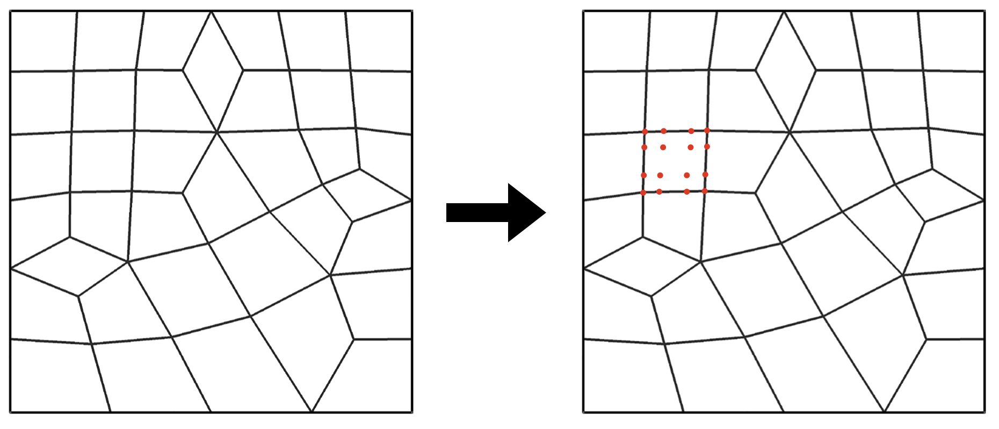

# 

| **Contacts**  |
| [](mailto:smarras@njit.edu) |
| [](mailto:yt277@njit.edu) |
| [](mailto:hang.wang@njit.edu) |
| **Citation** |
| [](https://doi.org/10.48550/arXiv.2401.05624) |

# JexpressoHOmesh
This is a simple package that reads a GMSH grid file (another reader could be added as needed) and adds high-order Legendre-Gauss-Lobatto or Legendre-Gauss nodes.





Suggested Julia version: 1.10.0

If you use JexpressoHOmesh please drop us a line to let us know. We'd like to add a link to your paper or work on this page.

Please cite JexpressoHOmesh with:

```
@misc{tissaoui2024,
      title={Efficient Spectral Element Method for the Euler Equations on Unbounded Domains in Multiple Dimensions}, 
      author={Yassine Tissaoui and James F. Kelly and Simone Marras},
      year={2024},
      eprint={2401.05624},
      archivePrefix={arXiv},
      primaryClass={math.NA}
}
```

If you are interested in contributing, please get in touch:
[Simone Marras](mailto:smarras@njit.edu)


# Some notes on using JexpressoHOmesh

To install and run the code assume Julia 1.10.0

## Setup 

After cloning JexpressoHOmesh do the following:

1.
```bashx
>> cd $JEXPRESSO_HOME
>> julia --project=.
```

```
pkg> instantiate
```
```
pkg> precompile
```


To run JexpressoHOmesh, do as follows:

Push problem name to ARGS
You need to do this only when you run a new problem
```bash
julia> push!(empty!(ARGS), PROBLEM_CASE_NAME::String)
julia> include("./src/JexpressoHOmesh.jl")
```

* PROBLEM_NAME is the name of your problem directory as $JEXPRESSO/problems/problem_case_name
* PROBLEM_CASE_NAME is the name of the subdirectory containing the specific setup that you want to run: 

The path would look like 
```$JEXPRESSO/problems/problems/PROBLEM_CASE_NAME```

Example 1:
```bash
julia> push!(empty!(ARGS), "grid");
julia> include("./src/JexpressoHOmesh.jl")
```


```
@article{tissaoui2024,
  author = {Y. Tissaoui and J. F. Kelly and S. Marras}
  title = {Efficient Spectral Element Method for the Euler Equations on Unbounded Domains in Multiple Dimensions},
  url = {https://arxiv.org/abs/2401.05624},
  year = {2024},
  journal = {arXiv:2401.05624 [math.NA]},
}
```

## Plotting
Files can be written to VTK. 

## Contacts
[Simone Marras](mailto:smarras@njit.edu)
