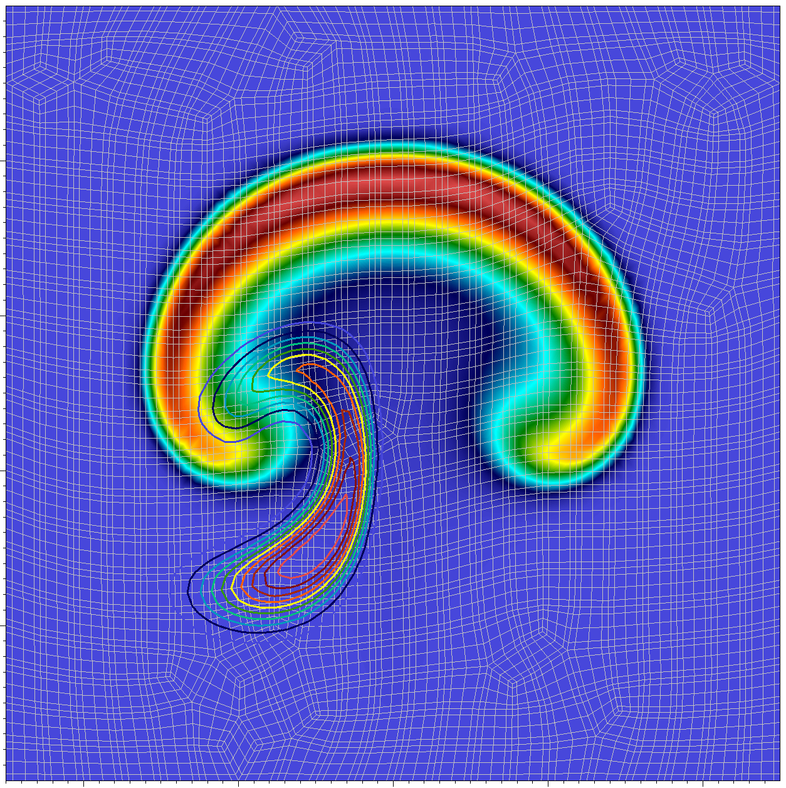
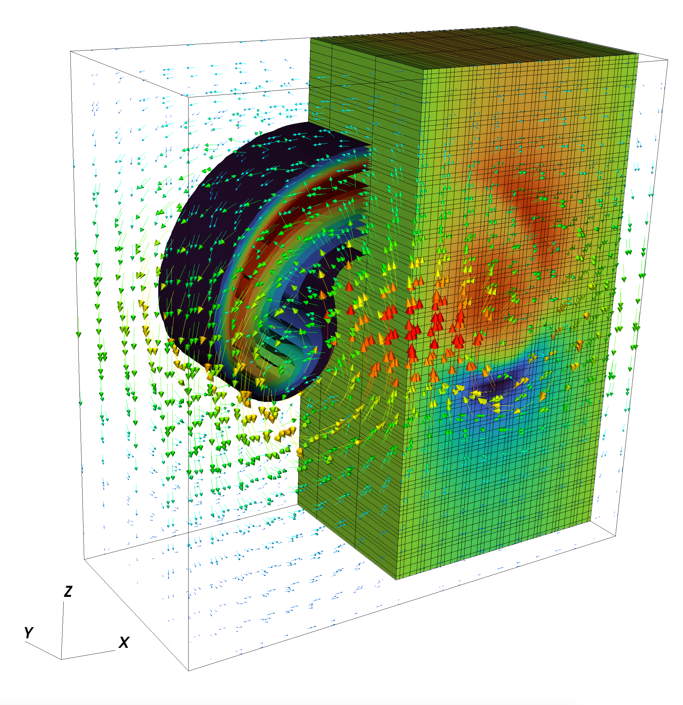
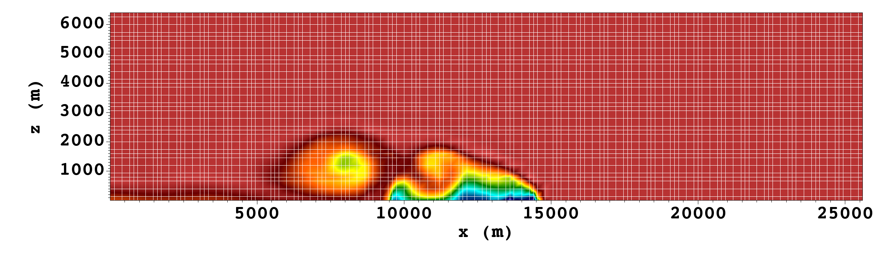
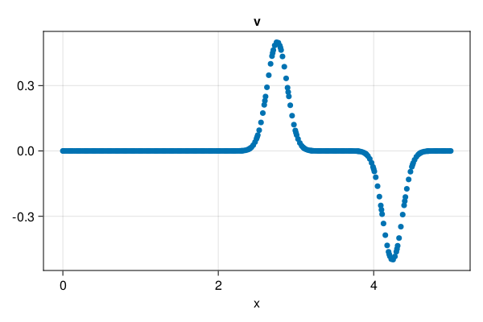
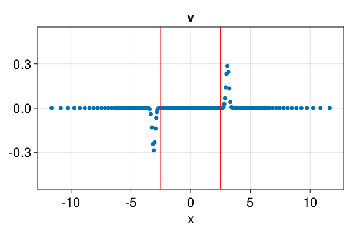
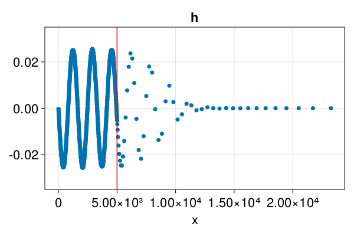
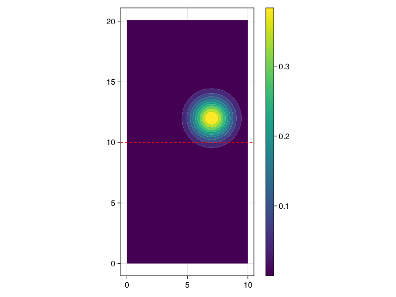
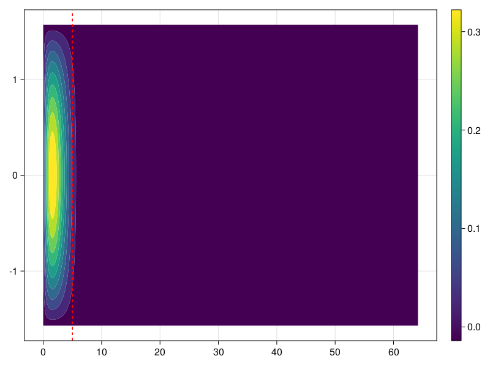
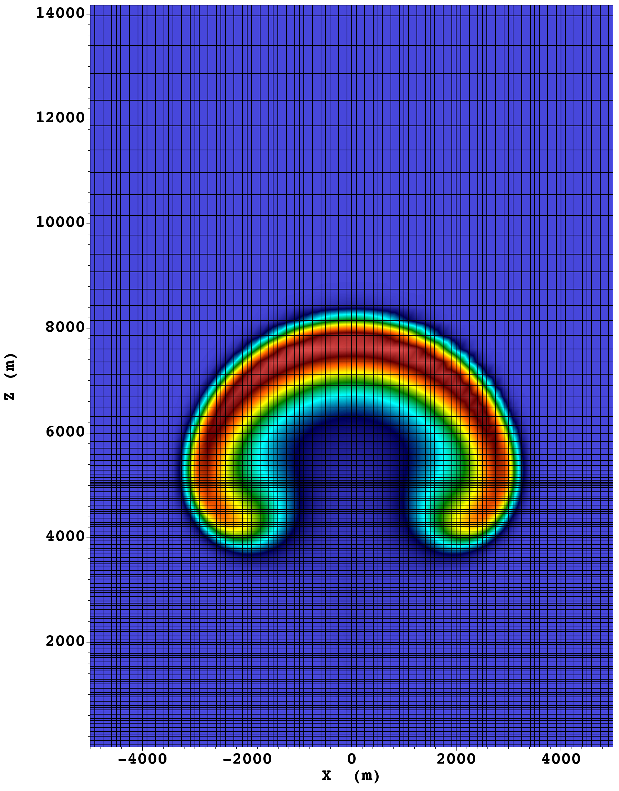
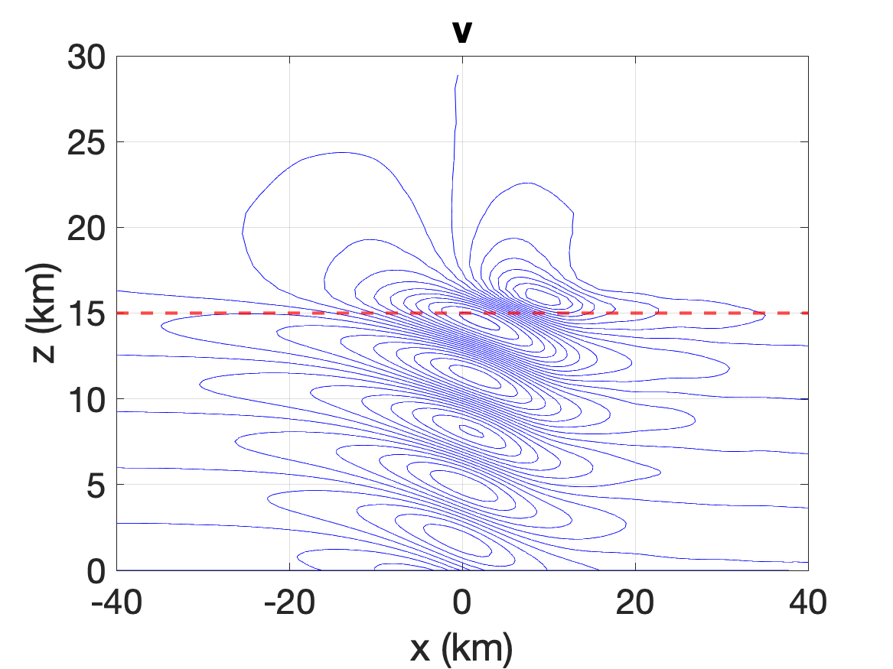

# 

| **Contacts**  |
| [](mailto:smarras@njit.edu) |
| [](mailto:yt277@njit.edu) |
| [](mailto:hang.wang@njit.edu) |
| **Citation** |
| [](https://doi.org/10.48550/arXiv.2401.05624) |

# JEXPRESSOHO
This is a simple package that reads a GMSH grid file (another reader could be added as needed) and adds high-order Legendre-Gauss-Lobatto or Legendre-Gauss nodes.

Suggested Julia version: 1.10.0

If you use JexpressoHO please drop us a line to let us know. We'd like to add a link to your paper or work on this page.

Please cite JexpressoHO using:

```
@misc{tissaoui2024,
      title={Efficient Spectral Element Method for the Euler Equations on Unbounded Domains in Multiple Dimensions}, 
      author={Yassine Tissaoui and James F. Kelly and Simone Marras},
      year={2024},
      eprint={2401.05624},
      archivePrefix={arXiv},
      primaryClass={math.NA}
}
```

If you are interested in contributing, please get in touch:
[Simone Marras](mailto:smarras@njit.edu)


# Some notes on using JEXPRESSO

To install and run the code assume Julia 1.10.0

## Setup 

After cloning JexpressoHO do the following:

1.
```bashx
>> cd $JEXPRESSO_HOME
>> julia --project=.
```

If on Apple, add Metal to the dependencies and continue to point 2:

1.apple
```
julia> ]
pkg> add Metal
```

2.
```
pkg> instantiate
```
```
pkg> precompile
```

Notice that points 1. and 2. are for all, but 1.apple is required only for Apple users.

To run JexpressoHO, do as follows:

Push problem name to ARGS
You need to do this only when you run a new problem
```bash
julia> push!(empty!(ARGS), EQUATIONS::String, EQUATIONS_CASE_NAME::String);
julia> include("./src/JexpressoHO.jl")
```

* PROBLEM_NAME is the name of your problem directory as $JEXPRESSO/problems/equations/problem_name
* PROBLEM_CASE_NAME is the name of the subdirectory containing the specific setup that you want to run: 

The path would look like 
```$JEXPRESSO/problems/equations/PROBLEM_NAME/PROBLEM_CASE_NAME```

Example 1: to solve the 2D Euler equations with buyoancy and two passive tracers defined in `problems/equations/CompEuler/thetaTracers` you would do the following:
```bash
julia> push!(empty!(ARGS), "CompEuler", "thetaTracers");
julia> include("./src/JexpressoHO.jl")
```





Example 2: to solve the 3D Euler equations with buyoancy defined in `problems/equations/CompEuler/3d` you would do the following:
```bash
julia> push!(empty!(ARGS), "CompEuler", "3d");
julia> include("./src/JexpressoHO.jl")
```




Example 3: to solve the 2D Euler equations leading to a density current defined in `problems/equations/CompEuler/dc` you would do the following:
```bash
julia> push!(empty!(ARGS), "CompEuler", "dc");
julia> include("./src/JexpressoHO.jl")
```



Example 4: to solve the 1D wave equation  defined in `problems/equations/CompEuler/wave1d` you would do the following:
```bash
julia> push!(empty!(ARGS), "CompEuler", "wave1d");
julia> include("./src/JexpressoHO.jl")
```




For ready to run tests, there are the currently available equations names:

* CompEuler (option with total energy and theta formulation)

The code is designed to create any system of conservsation laws. See CompEuler/case1 to see an example of each file.
Details will be given in the documentation (still WIP). Write us if you need help.

More are already implemented but currently only in individual branches. They will be added to master after proper testing.

## Laguerre semi-infinite element test suite
This section contains instructions to run all of the test cases presented in

```
@article{tissaoui2024,
  author = {Y. Tissaoui and J. F. Kelly and S. Marras}
  title = {Efficient Spectral Element Method for the Euler Equations on Unbounded Domains in Multiple Dimensions},
  url = {https://arxiv.org/abs/2401.05624},
  year = {2024},
  journal = {arXiv:2401.05624 [math.NA]},
}
```

Test 1: 1D wave equation with Laguerre semi-infinite element absorbing layers

The problem is defined in [`problems/CompEuler/wave1d_lag`](https://github.com/smarras79/JexpressoHO/tree/master/problems/equations/CompEuler/wave1d_lag) and by default output will be written to `output/CompEuler/wave1d_lag`. To solve this problem run the following commands from the Julia command line:

```bash
julia> push!(empty!(ARGS), "CompEuler", "wave1d_lag");
julia> include("./src/JexpressoHO.jl")
```



Test 2: 1D wave train for linearized shallow water equations

The problem is defined in [`problems/equations/AdvDiff/Wave_Train`](https://github.com/smarras79/JexpressoHO/tree/master/problems/equations/AdvDiff/Wave_Train) and by default output will be written to `output/AdvDiff/Wave_Train`. To solve this problem run the following commands from the Julia command line:

```bash
julia> push!(empty!(ARGS), "AdvDiff", "Wave_Train");
julia> include("./src/JexpressoHO.jl")
```



Test 3: 2D advection-diffusion equation

The problem is defined in [`problems/equations/AdvDiff/2D_laguerre`](https://github.com/smarras79/JexpressoHO/tree/master/problems/equations/AdvDiff/2d_Laguerre) and by default output will be written to `output/AdvDiff/2D_laguerre`. To solve this problem run the following commands from the Julia command line:

```bash
julia> push!(empty!(ARGS), "AdvDiff", "2D_laguerre");
julia> include("./src/JexpressoHO.jl")
```



Test 4: 2D Helmholtz equation

The problem is defined in [`problems/equations/Helmholtz/case1`](https://github.com/smarras79/JexpressoHO/tree/master/problems/equations/Helmholtz/case1) and by default output will be written to `output/Helmholtz/case1`. To solve this problem run the following commands from the Julia command line:

```bash
julia> push!(empty!(ARGS), "Helmholtz", "case1");
julia> include("./src/JexpressoHO.jl")
```



Test 5: Rising thermal bubble

The problem is defined in [`problems/equations/CompEuler/theta_laguerre`](https://github.com/smarras79/JexpressoHO/tree/master/problems/equations/CompEuler/theta_laguerre) and by default output will be written to `output/CompEuler/theta_laguerre`. To solve this problem run the following commands from the Julia command line:

```bash
julia> push!(empty!(ARGS), "CompEuler", "theta_laguerre");
julia> include("./src/JexpressoHO.jl")
```



Test 6: Hydrostatic linear mountain waves

The problem is defined in [`problems/equations/CompEuler/HSmount_Lag_working`](https://github.com/smarras79/JexpressoHO/tree/master/problems/equations/CompEuler/HSmount_Lag_working) and by default output will be written to `output/CompEuler/HSmount_Lag_working`. To solve this problem run the following commands from the Julia command line:

```bash      
julia> push!(empty!(ARGS), "CompEuler", "HSmount_Lag_working");
julia> include("./src/JexpressoHO.jl")
```



## Plotting
Files can be written to VTK (recommended) or png. For the png plots, we use [Makie](https://github.com/MakieOrg/Makie.jl). If you want to use a different package,
modify ./src/io/plotting/jplots.jl accordinly.

For non-periodic 2D tests, the output can also be written to VTK files by setting the value "vtk" for the usier_input key :outformat

## Contacts
[Simone Marras](mailto:smarras@njit.edu), [Yassine Tissaoui](mailto:yt277@njit.edu), [Hang Wang](mailto:hang.wang@njit.edu)
